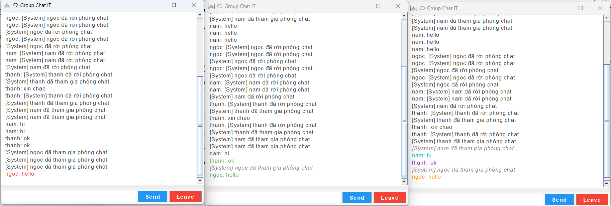
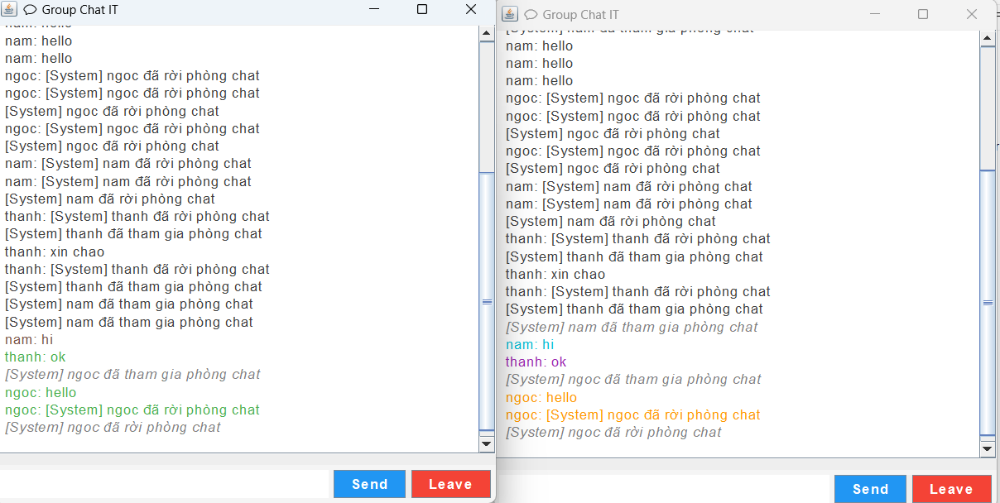

<h2 align="center">
    <a href="https://dainam.edu.vn/vi/khoa-cong-nghe-thong-tin">
    🎓 Faculty of Information Technology (DaiNam University)
    </a>
</h2>
<h2 align="center">
    CHAT NHÓM SỬ DỤNG GIAO THỨC RMI
</h2>
<div align="center">
    <p align="center">
        
        
        
    </p>

[](https://www.facebook.com/DNUAIoTLab)
[](https://dainam.edu.vn/vi/khoa-cong-nghe-thong-tin)
[](https://dainam.edu.vn)

</div>


---

## 📖 1. Giới thiệu hệ thống
Ứng dụng **Chat Nhóm sử dụng giao thức RMI** cho phép nhiều người dùng giao tiếp trực tuyến thời gian thực thông qua công nghệ **Java RMI (Remote Method Invocation)**.  

**Server**: đóng vai trò trung tâm, quản lý danh sách client và phân phối tin nhắn.  
**Client**: cung cấp giao diện trực quan để gửi và nhận tin nhắn.  

**Các chức năng chính:**
- **Server**:
  - Quản lý danh sách client kết nối
  - Phát tin nhắn đến toàn bộ client
  - Gửi thông báo hệ thống (người tham gia/rời khỏi)
- **Client**:
  - Kết nối đến server
  - Gửi và nhận tin nhắn
  - Hiển thị thông báo hệ thống
  - Giao diện trực quan bằng Swing

---

## 🔧 2. Công nghệ sử dụng
#### Java RMI (Remote Method Invocation)  
- Cung cấp cơ chế gọi phương thức từ xa giữa client và server.  
- Sử dụng interface `Remote` và các lớp `UnicastRemoteObject`, `Registry`.  

#### Java Swing  
- Xây dựng giao diện người dùng (GUI) với các thành phần:  
  - `JFrame`: cửa sổ chính  
  - `JTextArea`: hiển thị nội dung chat  
  - `JTextField`: nhập tin nhắn  
  - `JButton`: gửi tin nhắn  
  - `JScrollPane`: hỗ trợ cuộn lịch sử chat  

---

## 🚀 3. Hình ảnh các chức năng

<p align="center">
  
</p>
<p align="center">
  <em>Hình 1: Giao diện chat chính của các client</em>
</p>

<p align="center">
  
</p>
<p align="center">
  <em>Hình 2: Giao diện Client chat nhóm</em>
</p>

<p align="center">
  
</p>
<p align="center">
  <em>Hình 3: Thông báo khi có client rời khỏi nhóm chat</em>
</p>

---

## 📝 4. Hướng dẫn cài đặt và sử dụng

### 🔧 Yêu cầu hệ thống
- **Java Development Kit (JDK)**: Phiên bản 11 trở lên  
- **Hệ điều hành**: Windows / macOS / Linux  
- **IDE khuyến nghị**: IntelliJ IDEA, Eclipse, hoặc NetBeans  
- **Bộ nhớ**: Tối thiểu 512MB RAM  

---

### 📦 Các bước triển khai

#### 🔹 Bước 1: Chuẩn bị môi trường
1. **Cài đặt JDK** nếu chưa có:  
   - Kiểm tra bằng lệnh:  
     ```bash
     java -version
     javac -version
     ```
   - Nếu chưa có, tải JDK tại [Oracle JDK](https://www.oracle.com/java/technologies/javase-downloads.html) hoặc [OpenJDK](https://adoptium.net/).

2. **Tải mã nguồn dự án**:  
   - Clone repo bằng Git:  
     ```bash
     git clone https://github.com/mthanh04/LTM-ChatRoom
     ```
   - Hoặc tải file `.zip` và giải nén.

---

#### 🔹 Bước 2: Biên dịch mã nguồn
Di chuyển đến thư mục `bin` rồi biên dịch:  
```bash
cd BOXCHAT/bin
rmiregistry
```
#### 🔹 Bước 3: Chạy file ChatServer.java

#### 🔹 Bước 4: Chạy file ChatClient.java
- Giao diện chat sẽ hiện ra

## 👤 5. Liên hệ
**Họ tên**: Trịnh Minh Thành.  
**Lớp**: CNTT 16-03.  
**Email**: thanhmeo260604@gmail.com.

© 2025 Faculty of Information Technology, DaiNam University. All rights reserved.


